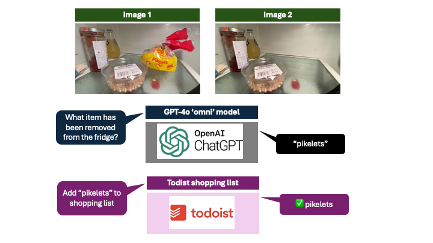

# FridgeBot

Monitor the contents of my fridge and automatically add grocery items to my shopping list with GPT-4o vision API

OpenAI recently announced their new  generative AI model GPT-4o — the “o” stands for “omni,” referring to the model’s ability to mixed modalities including  text, speech, and video. I wanted to give GPT-4o  a real challenge - helping me keep on top of the shopping list by automatically monitoring the contents of my fridge and adding grocery items when I had run out of something.

## Overview



## Setup virtual python environment
Create a [virtual python](https://packaging.python.org/en/latest/guides/installing-using-pip-and-virtual-environments/) environment to keep dependencies separate. The _venv_ module is the preferred way to create and manage virtual environments.

 ```console
python3 -m venv .venv
```

Before you can start installing or using packages in your virtual environment you’ll need to activate it. 

```console
source .venv/bin/activate
pip install --upgrade pip
pip install -r requirements.txt
 ```
 
 ## API setup

 ```bash
 cp -i config_secrets_example.py config_secrets.py  
 ```

Edit `config_secrets.py` with _OpenAPI_ tokens along with the _Todoist_ API secret tokens

- [OpenAI API keys](https://platform.openai.com/api-keys)
- [Todoist API keys](https://app.todoist.com/app/settings/integrations/developer)

## FridgeBot - video process only 

To run FridgeBot with example video file without calling OpenAI run the following

```bash
python fridgebot.py --video media/pikelets.mov
```

This should generate two files representing the first lit image and the last lit image within the video `media/pikelets.1.jpg` and `media/pikelets.2.jpg`


## FridgeBot - video process and OpenAI 

To run FridgeBot with example video file, calling OpenAI run the following

```bash
python fridgebot.py --video media/pikelets.mov --openai
```

This should generate two files, and query the OpenAI API to identify the item removed - `Pikelets`

## FridgeBot - video process, OpenAI and Todoist

To run FridgeBot with example video file, calling OpenAI and adding item to Todoist

```bash
python fridgebot.py --video media/pikelets.mov --openai --todoist
```

This should generate two files, and query the OpenAI API and add `Pikelets` to the Todoist shopping list


